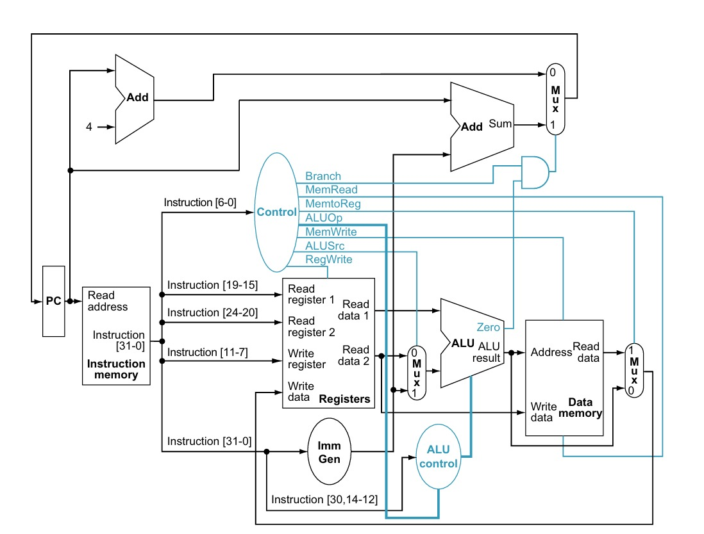
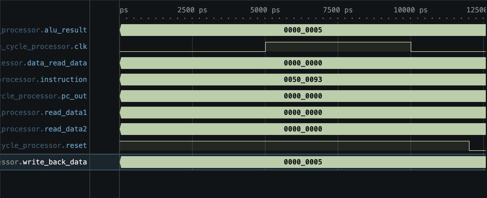

::: hero
# Single Cycle Processor

<p class="subtitle">

Complete RISC-V inspired CPU executing any instruction in exactly one clock cycle

</p>

<p class="meta">

RISC-V \| Verilog HDL \| CE222 Digital Design

</p>
:::

------------------------------------------------------------------------

## Intro to Single Cycle

::::: split
::: left-panel
### What is It?

A **single-cycle processor** completes every instruction in one clock cycle.

**Fetch** → **Decode** → **Execute** → **Memory** → **Write-back**

### Why Single Cycle?

-   Straightforward control logic
-   No pipelined hazards\
-   Clean, educational datapath
:::

::: right-panel
``` verilog
// All stages in ONE cycle

Fetch:   instruction ← mem[PC]
Decode:  signals ← opcode
Execute: result ← ALU(a,op,b)
Memory:  data ← RAM[address]
WriteB:  reg[rd] ← result
```
:::
:::::

------------------------------------------------------------------------

## What This Processor Can Do

::::: split
::: left-panel
### Instruction Set

**Arithmetic & Logic** - add, sub - and, or, xor

**Memory Operations** - lw (load word) - sw (store word)

**Control Flow** - beq (branch if equal)
:::

::: right-panel
``` verilog
module single_cycle_processor (
    input clk, reset,
    output [31:0] pc_out,
    output [31:0] instruction,
    output [31:0] alu_result,
    output [31:0] write_back_data,
    output [31:0] read_data1,
    output [31:0] read_data2,
    output [31:0] data_read_data
);

// All 32-bit RISC-V signals
// connected through modular units

wire ALUSrc, MemtoReg, RegWrite, MemRead, MemWrite, Branch;
wire [1:0] ALUOp;
wire [3:0] alu_operation;
wire zero;
wire [31:0] pc_current, pc_plus4, branch_target, pc_next;
wire [31:0] immediate, alu_input2;

PC pc_unit (.clk(clk), .reset(reset), .PC_in(pc_next), .PC_out(pc_current));

instruction_memory imem (.address(pc_current), .instruction(instruction));

control ctrl (.opcode(instruction[6:0]), .ALUSrc(ALUSrc), .MemtoReg(MemtoReg), 
              .RegWrite(RegWrite), .MemRead(MemRead), .MemWrite(MemWrite), 
              .Branch(Branch), .ALUOp(ALUOp));

register_file reg_file (.clk(clk), .reset(reset), .RegWrite(RegWrite), 
                       .read_reg1(instruction[19:15]), .read_reg2(instruction[24:20]), 
                       .write_reg(instruction[11:7]), .write_data(write_back_data), 
                       .read_data1(read_data1), .read_data2(read_data2));

alu_control alu_ctrl (.ALUOp(ALUOp), .Funct7(instruction[31:25]), 
                     .Funct3(instruction[14:12]), .Operation(alu_operation));

alu alu_unit (.a(read_data1), .b(alu_input2), .alu_control(alu_operation), 
              .result(alu_result), .zero(zero));

assign pc_next = (Branch & zero) ? branch_target : pc_plus4;
assign pc_out = pc_current;

endmodule
```
:::
:::::

------------------------------------------------------------------------

## Component: Program Counter (PC)

::::: split
::: left-panel
### Purpose

**Holds** current instruction address\
**Updates** to next PC every cycle

### Operation

On each clock edge: - If reset: PC ← 0 - Else: PC ← next address
:::

::: right-panel
``` verilog
module PC(
    input clk,
    input reset,
    input [31:0] PC_in,
    output reg [31:0] PC_out
);

always @(posedge clk or posedge reset) begin
    if (reset)
        PC_out <= 32'b0;
    else
        PC_out <= PC_in;
end

endmodule
```
:::
:::::

------------------------------------------------------------------------

## Component: Instruction Memory

::::: split
::: left-panel
### Purpose

**Stores** program instructions\
**Outputs** instruction at address combinationally

### Features

-   Read-only (ROM)
-   32 × 32-bit words
-   Address-driven lookup
-   No clock dependency
:::

::: right-panel
``` verilog
module instruction_memory (
    input [31:0] address,
    output reg [31:0] instruction
);

reg [31:0] memory [0:15];

initial begin
    // addi x1, x0, 5 
    memory[0]  = 32'h00500093;
    // addi x2, x0, 10
    memory[1]  = 32'h00A00113;
    // add x3, x1, x2 (x3 = 15)
    memory[2]  = 32'h002081B3;
end

always @(*) begin
    if (address[31:0] <= 4'd15)
        instruction = memory[address[31:0]];
    else
        instruction = 32'h00000000;
end

endmodule
```
:::
:::::

------------------------------------------------------------------------

## Component: Control Unit

::::: split
::: left-panel
### Purpose

**Generates** control signals from opcode

### Control Outputs

-   ALUSrc
-   MemtoReg
-   RegWrite
-   MemRead
-   MemWrite
-   Branch

Maps instruction opcode to bit patterns.
:::

::: right-panel
``` verilog
module control (
    input [6:0] opcode,
    output reg ALUSrc, MemtoReg,
    output reg RegWrite, MemRead,
    output reg MemWrite, Branch,
    output reg [1:0] ALUOp
);

always @(*) begin
    {ALUSrc, MemtoReg, RegWrite, MemRead, MemWrite, Branch, ALUOp} = 8'b0;

    case(opcode)
        7'b0110011: begin // R-type
            RegWrite = 1'b1; ALUOp = 2'b10;
        end
        7'b0000011: begin // lw
            ALUSrc = 1'b1; MemtoReg = 1'b1; 
            RegWrite = 1'b1; MemRead = 1'b1;
        end
        7'b0010011: begin // addi
            ALUSrc = 1'b1; RegWrite = 1'b1; ALUOp = 2'b11;
        end
    endcase
end

endmodule
```
:::
:::::

------------------------------------------------------------------------

## Component: Register File

::::: split
::: left-panel
### Purpose

**Stores** 32 registers (32-bit each)\
**Reads** 2 ports simultaneously\
**Writes** 1 port per cycle

### Design

Dual-read, single-write. Register 0 always zero.

### Timing

-   Reads: combinational
-   Writes: synchronous (clock edge)
:::

::: right-panel
``` verilog
module register_file (
    input clk, reset, RegWrite,
    input [4:0] read_reg1, read_reg2, write_reg,
    input [31:0] write_data,
    output [31:0] read_data1, read_data2
);

reg [31:0] registers [0:31];

always @(posedge clk or posedge reset) begin
    if (reset) begin
        for (i = 0; i < 32; i = i + 1)
            registers[i] <= 32'b0;
    end else if (RegWrite && write_reg != 5'b0) begin
        registers[write_reg] <= write_data;
    end
end

assign read_data1 = (read_reg1 == 0) ? 32'b0 : registers[read_reg1];
assign read_data2 = (read_reg2 == 0) ? 32'b0 : registers[read_reg2];

endmodule
```
:::
:::::

------------------------------------------------------------------------

## Component: ALU

::::: split
::: left-panel
### Purpose

**Computes** arithmetic/logic operations\
**Sets** zero flag for branches

### Operations

-   Add / Subtract
-   AND / OR / XOR
-   SLT (set less than)

### Output

32-bit result + 1-bit zero flag
:::

::: right-panel
``` verilog
module alu(
    input [31:0] a, b,
    input [3:0] alu_control,
    output reg [31:0] result,
    output zero
);

always @(*) begin
    case (alu_control)
        4'b0000: result = a & b;
        4'b0001: result = a | b;
        4'b0010: result = a + b;
        4'b0110: result = a - b;
        default: result = 32'b0;
    endcase
end

assign zero = (result == 32'b0);

endmodule
```
:::
:::::

------------------------------------------------------------------------

## Component: Data Memory

::::: split
::: left-panel
### Purpose

**Stores** 32 × 32-bit data words\
**Synchronous writes**, combinational reads

### Operation

-   MemWrite=1 & clock → write
-   MemRead=1 → read combinationally
:::

::: right-panel
``` verilog
module data_memory (
    input clk, MemWrite, MemRead,
    input [31:0] address,
    input [31:0] write_data,
    output [31:0] read_data
);

reg [31:0] memory [0:31];

always @(posedge clk) begin
    if (MemWrite)
        memory[address[6:2]] <= write_data;
end

assign read_data = MemRead ? memory[address[6:2]] : 32'b0;

endmodule
```
:::
:::::

------------------------------------------------------------------------

## Architecture Overview

::: image-slide

:::

------------------------------------------------------------------------

## Demo: Simulation Output

::: image-slide

:::

------------------------------------------------------------------------

## Datapath Execution Example

::::: split
::: left-panel
### ADD Instruction Trace

**One instruction, one clock cycle:**

-   **Fetch**: instruction loaded from PC
-   **Decode**: R1, R2, and R3 selected
-   **Execute**: ALU computes `5 + 3 = 8`
-   **Write-back**: R3 receives the result

**No memory access needed.** **Total time: 1 clock cycle ✓**
:::

::: right-panel
```         
INSTRUCTION: ADD R3, R1, R2 (opcode=110001)

┌─────────────────────────────┐
│ PC = 0x00001000             │
├─────────────────────────────┤
│ R1 = 5, R2 = 3              │
├─────────────────────────────┤
│ Execute: 5 + 3 = 8          │
├─────────────────────────────┤
│ Result: R3 ← 8              │
├─────────────────────────────┤
│ PC ← 0x00001004             │
└─────────────────────────────┘

After Cycle 1: R3 = 8 ✓
```
:::
:::::

------------------------------------------------------------------------

## Execution Example: BEQ

::::: split
::: left-panel
### Branch If Equal

-   Compare two registers in the ALU
-   If `Zero = 1`, branch target is chosen
-   If not equal, PC moves to `PC + 4`

**Control idea:** `PCSrc = Branch & Zero`
:::

::: right-panel
```         
BEQ R1, R2, label

PC = 0x00001000
R1 = 7, R2 = 7

ALU compares R1 - R2
Zero = 1
Branch target = 0x00001020

PCSrc = 1
Next PC = 0x00001020
```
:::
:::::

------------------------------------------------------------------------

## Execution Example: SW

::::: split
::: left-panel
### Store Word

-   Base register plus immediate gives the address
-   Data comes from the second register
-   Memory writes on the clock edge

**Control idea:** `MemWrite = 1`
:::

::: right-panel
```         
SW R2, 4(R1)

R1 = 0x00001000
R2 = 42

Address = R1 + 4 = 0x00001004
MemWrite = 1
Memory[0x00001004] <- 42

PC <- PC + 4
```
:::
:::::

------------------------------------------------------------------------

## Execution Example: LW

::::: split
::: left-panel
### Load Word

-   Address comes from base register plus offset
-   Data is read from memory
-   Register file writes the loaded value back

**Control idea:** `MemRead = 1`, `MemtoReg = 1`
:::

::: right-panel
```         
LW R3, 4(R1)

R1 = 0x00001000

Address = R1 + 4 = 0x00001004
Memory[0x00001004] = 42

MemRead = 1
R3 <- 42

PC <- PC + 4
```
:::
:::::

------------------------------------------------------------------------

## Design Trade-offs

::::: split
::: left-panel
### ✅ Advantages

-   **Simple Control**: Straightforward logic, easy to design
-   **No Hazards**: All dependencies resolved in one cycle
-   **Educational**: Clear datapath, great for learning
-   **Fast Decision Time**: One cycle per instruction conceptually

### ❌ Disadvantages

-   **Slow Clock**: Limited by critical path (longest stage)
-   **Hardware Waste**: Simple instructions pay for complex ones
-   **Power Inefficiency**: Must run at slowest stage's speed
-   **Not Practical**: Real processors use pipelining/multi-cycle
:::

::: right-panel
```         
Single-Cycle vs Pipelined:

SINGLE-CYCLE (This):
Cycle: |===I1===|===I2===|===I3===|

3 instructions: 3 cycles
Latency: HIGH, Throughput: OK

PIPELINED (Future):
Cycle: |I1|I2|I3|I4|I5|I6|

3 instructions: 4 cycles
Latency: LOW, Throughput: GREAT

Trade-off: Design complexity
for better performance
```
:::
:::::

------------------------------------------------------------------------

## Key Concepts

::::: split
::: left-panel
### Critical Path

$$T_{clk} \geq T_{IF}+T_{ID}+T_{EX}+T_{MEM}+T_{WB}$$

**Bottleneck**: Every instruction waits for the slowest stage

### Why It Matters

-   One cycle per instruction
-   Clock speed limited by longest stage
-   Simple control, but inefficient
:::

::: right-panel
```         
Critical Path Diagram:

PC -> IMEM -> Decode -> ALU -> DMEM -> WB
IF     ID     EX      MEM    WB

Clock period must cover the slowest path:

Tclk = IF + ID + EX + MEM + WB

That is why every instruction pays the cost of the longest operation.
```
:::
:::::

------------------------------------------------------------------------

::: conclusion
## Summary

<p class="conclusion-item">

<strong>Architecture:</strong> Complete single-cycle RISC-V processor with all five pipeline stages in one clock cycle

</p>

<p class="conclusion-item">

<strong>Components:</strong> PC, instruction memory, control unit, register file, ALU, data memory

</p>

<p class="conclusion-item">

<strong>Insight:</strong> Simple and elegant, but limited by critical path. Foundation for pipelined designs.

</p>

<p class="conclusion-item">

<strong>Next Steps:</strong> Pipeline architecture, hazard detection, cache design

</p>
:::